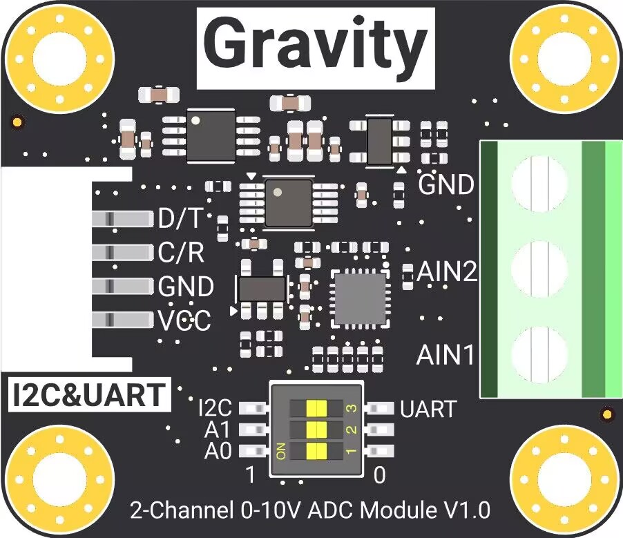

# DFRobot_ADS1115_0_10V
- [English Version](./README.md)

该产品是一款集成了ADS1115芯片的模块。可通过拨码开关的方式选择I2C、UART通讯方式，也可以通过拨码开关切换模块的I2C地址。外部设备通过gravity接口可以分别获取两组分辨率为0.01mv的电压数据。该模块可以用来精确测量0-10v的直流电压。
 

## 产品链接(https://www.dfrobot.com.cn/)

## 目录

* [概述](#概述)
* [库安装](#库安装)
* [方法](#方法)
* [兼容性](#兼容性y)
* [历史](#历史)
* [创作者](#创作者)

## 概述

  * 获取电压，选择获取通道1或通道2的电压
  * 测量电压精度，0.01mv


## 库安装
要使用这个库，首先将库下载到 Raspberry Pi，然后打开 examples 文件夹。要运行示例，请在命令行中输入 `python <示例名>.py`。例如，要执行 get_value.py，输入：

```
python get_value.py
```

## 方法

```python
'''!
  @fn begin
  @brief 初始化通讯方式
  @return 返回初始化状态
'''
  def begin(self)

'''!
  @fn get_value
  @brief 获取电压值
  @param channel 选择通道1或通道2
  @note 只能输入1或2，其他值返回0
  @return 电压值，单位 mV
'''
  def get_value(self, channel)

```
## 兼容性

| 主板         | 通过 | 未通过 | 未测试 | 备注 |
| ------------ | :--: | :----: | :----: | :--: |
| RaspberryPi2 |      |        |   √    |      |
| RaspberryPi3 |      |        |   √    |      |
| RaspberryPi4 |  √   |        |        |      |

* Python 版本

| Python  | 通过 | 未通过 | 未测试 | 备注 |
| ------- | :--: | :----: | :----: | ---- |
| Python2 |  √   |        |        |      |
| Python3 |  √   |        |        |      |

## 历史

- 2026/09/14 - V1.0.2 版本
- 2024/12/13 - V1.0.1 版本
- 2024/07/23 - V1.0.0 版本

## 创作者

Written by lr(rong.li@dfrobot.com), 2024. (Welcome to our website)
